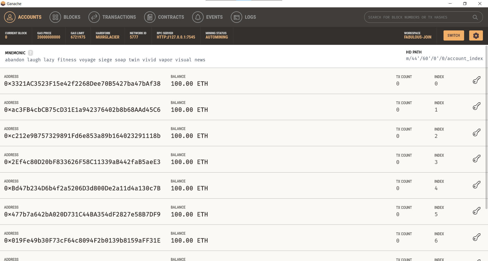
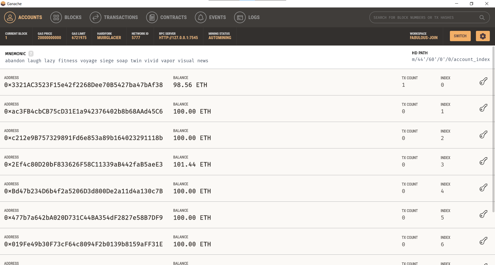
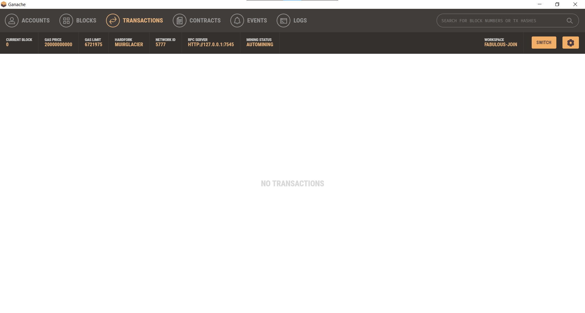
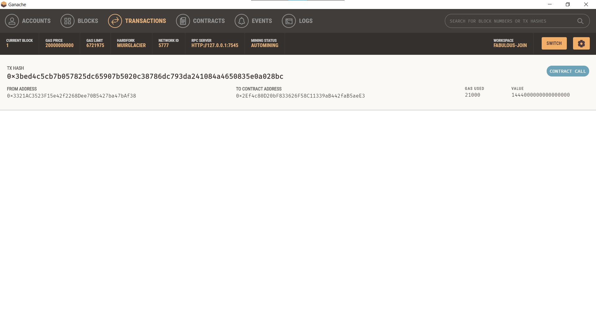
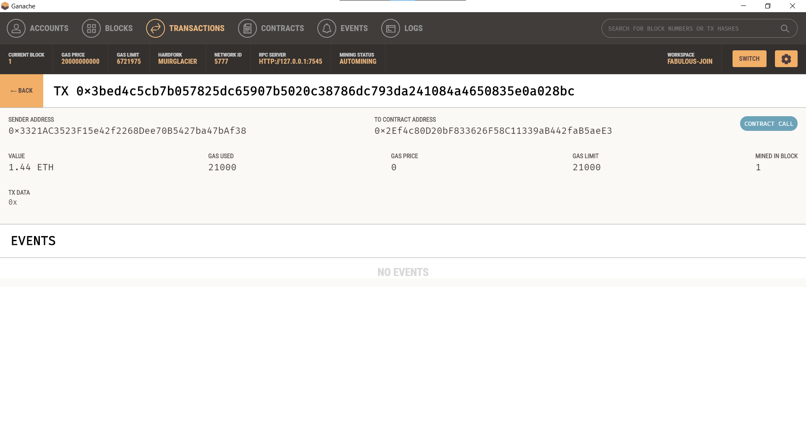

# Crypto Pay


## Background

Crypto Pay is an application that allows users to select fintech professionals from among a predefined list of candidates, hire them, and pay them with cryptocurrency.

## Installation

```bash
# This app was tested on python 3.9.7
# Create a virtual environment and activate it
pip install -r requirements.txt
```

## Ganache Demo

Install [Ganache](https://trufflesuite.com/ganache/index.html) before trying the following steps:

1. Start Ganache and copy the account's seed phrase.
2. Using [SAMPLE.env](SAMPLE.env) as a template, create a `.env` file and add Ganache's mnemonic seed phrase to it.
3. Run the app: `streamlit run app.py`
4. On the resulting webpage, select a candidate that you would like to hire from the appropriate drop-down menu.
5. Enter the number of hours that you would like to hire them for.
6. Click the Send Transaction button to sign and send the transaction with your Ethereum account information.
7. To see transaction details, go to the Transactions section of Ganache.

## Ganache Sample Transaction Results

### Balances Before


### Balances After


### History Before


### History After


### Streamlit Transaction

Streamlit didn't immediately update the account balances in the sidebar but still returns the validated transaction hash.


### Ganache Transaction Details

